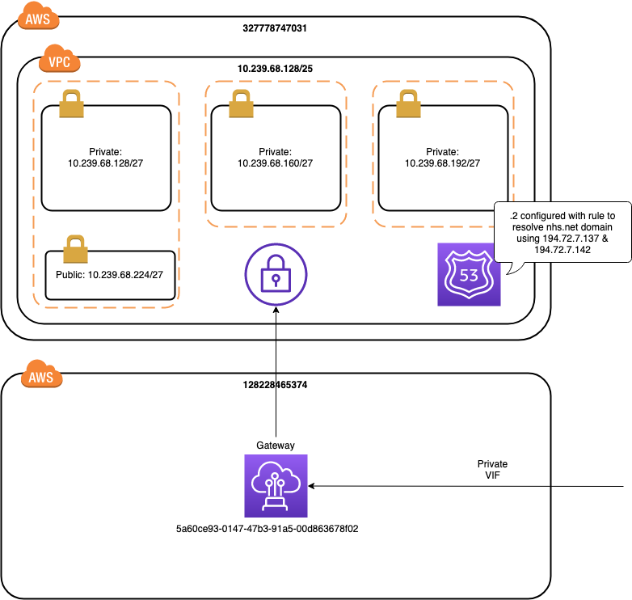

# Connecting to Direct Connect



## Requirements
Install and ensure available on path
- [terraform](https://www.terraform.io/) v0.11.11
- [terragrunt](https://github.com/gruntwork-io/terragrunt#install-terragrunt) v0.17.4
- bash [on windows](https://gitforwindows.org/)
- make [on windows](https://sourceforge.net/projects/ezwinports/files/make-4.2.1-without-guile-w32-bin.zip/download)
- [aws cli](https://docs.aws.amazon.com/cli/latest/userguide/cli-chap-install.html)

## Pre-requisites
Locate secrets in SSM Parameter Store for:
- `/NHS/dev-327778747031/tf/opentest/ec2_keypair` - SSH public key to use for OpenTest Gateway Host
- `/NHS/dev-327778747031/tf/opentest/ec2_keypair_private` - SSH private key to use for OpenTest Gateway Host

## Set Up Steps
- Ensure your AWS setup is configured to allow access to account `327778747031`
- cd to ```terraformscripts/dev-327778747031/dxnetwork```
- Run `make` in the root of the project

## Configuration
Configuration is in the file: `terraformscripts/dev-327778747031/dxnetwork/terraform.tfvars`
- `aws_region` the AWS region that will be used for provisioning resources
- `availability_zones` the set of AWS availability zones within the region to use
- `stage` the stage, e.g. dev, test, prod
- `vpc_cidr` the CIDR block association with the VPC - this must be allocated from HSCN address space
- `vpn_gateway_amazon_side_asn` the BGP ASN to use on the Amazon side for the VPN gateway
- `dx_gateway_owner_account_id` the id of the AWS account that owns the direct connect gateway
- `dx_gateway_id` the id of the direct connect gateway within the direct connect gateway account
- `dns_server_ip_addresses` the ip addresses of the DNS servers to use for resolving addresses on HSCN
- `provision_jump` whether or not to provision a jump box (1 to provision; 0 to deprovision)

## Access Jump Box
A jump box can be provisioned in the public subnet of the VPC:
- Ensure that the configuration variable `provision_jump` is set to `1` and update the AWS resources using terraform
- Extract the IP address for the jump box

```
$ terragrunt output -json | jq -r '.jump_ip_address.value[]'
```

- Extract the SSH private key from the SSM parameter store

```
$ aws-vault exec nhsd -- aws ssm get-parameter --name /NHS/dev-327778747031/tf/opentest/ec2_keypair_private --query Parameter.Value --with-decryption --output text > ~/.ssh/jump

$ chmod 0600 ~/.ssh/jump
```

- SSH onto the Jump box

```
ssh -i ~/.ssh/jump ec2-user@<ip-address>
```
